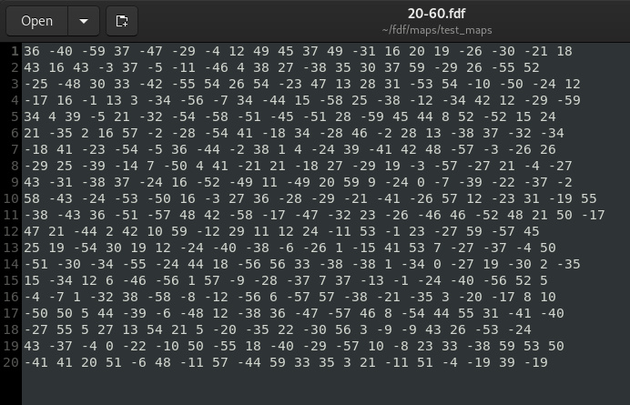

# FdF

FDF is short for ’fil de fer’ in French which means ’wireframe
model’.\
This project is about creating a simple wireframe model representation of a 3D land-
scape by linking various points (x, y, z) and representing them on the screen in 2D.

## Rendering

Your program has to represent the model in isometric projection.\
The coordinates of the landscape are stored in a .fdf file passed as a parameter to
your program.\
Each number represents a point in space:
- The horizontal position corresponds to its axis.
- The vertical position corresponds to its ordinate.
- The value corresponds to its altitude.
Keep in mind that the goal of this project is not to parse maps! However, this doesn’t
mean that your program should crash when run. It means that we assume the map
contained in the file is properly formatted

## Graphic management

- Your program has to display the image in a window.
- The management of your window must remain smooth (changing to another win-
dow, minimizing, and so forth).
- Pressing ESC must close the window and quit the program in a clean way.
- Clicking on the cross on the window’s frame must close the window and quit the
program in a clean way.
- The use of the images of the MiniLibX is mandatory.

## Examples
20-60 map

map t1 with colors

## FdF plan
- Argument input check.
- Read map into string array (get_next_line).
- Read each map data point into into a structure (register z coordinate and color).
- Initialize mlx and create a new window.
- Create the hooks for x butoon and esc key.
- Create new mlx image and associate it to the main data structure.
- Itarate over the size of the map and transfer z_coordinate and color to each point and the next connecting point. x → x1, y → y1 etc.
- Transform the map:
  - Scale (diagonal of the map should be less than the height of the image size). Ideally you  would take into account the z coordinate, but this project scales only based on map size.
  - Isometric rotation for each point (this takes into account the z coordinate).
  - Center the map by shifting the points.
- Draw the line between the two points, using Bresenhams algorithm.
- After drawing everything into the mlx image, place it on the screen.

## Norminette
This project has to be written in accordance with the Norm, which is the coding standard of the school 42.

The Norm includes:
- Forbidden: for, do...while, switch, case, goto, ternary operators and variable-length arrays 
- Maximum of 25 lines per function
- Maximum line length: 80 columns
- Maximum 4 parameters per function 
- Variable assignments and declarations must be on separate lines
- etc...

  
## Tips

Keycodes: look for X11 include file "keysymdef.h” /usr/include/X11/keysymdef.h. Convert hex to dec to use in the code.
Or you can use this little handy program to find your keycodes: [Keychecker from Heitor github](https://github.com/HeitorMP/minilibx_key_checker/).

## Materials

MiniLibX Guides
 - [Harm Smits MiniLibX Guide](https://harm-smits.github.io/42docs/libs/minilibx)
 - [PulgaMecanica MiniLibX Guide](https://pulgamecanica.herokuapp.com/posts/7)
 - [Aurelien Brabant MiniLibX Guide](https://aurelienbrabant.fr/blog/pixel-drawing-with-the-minilibx)

Bresenham Drawing Algorithm

- [Difference between DDA and Bresenham](https://www.tutorialandexample.com/line-drawing-algorithm)
- [Bresenham algorithm demonstration by Abdul Bari YouTube](https://www.youtube.com/watch?v=RGB-wlatStc&t=2286s)
- [Tutorial on Bresenhams for all octants](https://jstutorial.medium.com/how-to-code-your-first-algorithm-draw-a-line-ca121f9a1395)
   
Other materials
- [Error handling YouTube](https://www.youtube.com/watch?v=OOuZLI5ingc)
- [Exit function YouTube](https://www.youtube.com/watch?v=8RucxSeAemw)
- [Isometric projection Wikipedia](https://en.wikipedia.org/wiki/Isometric_projection)
